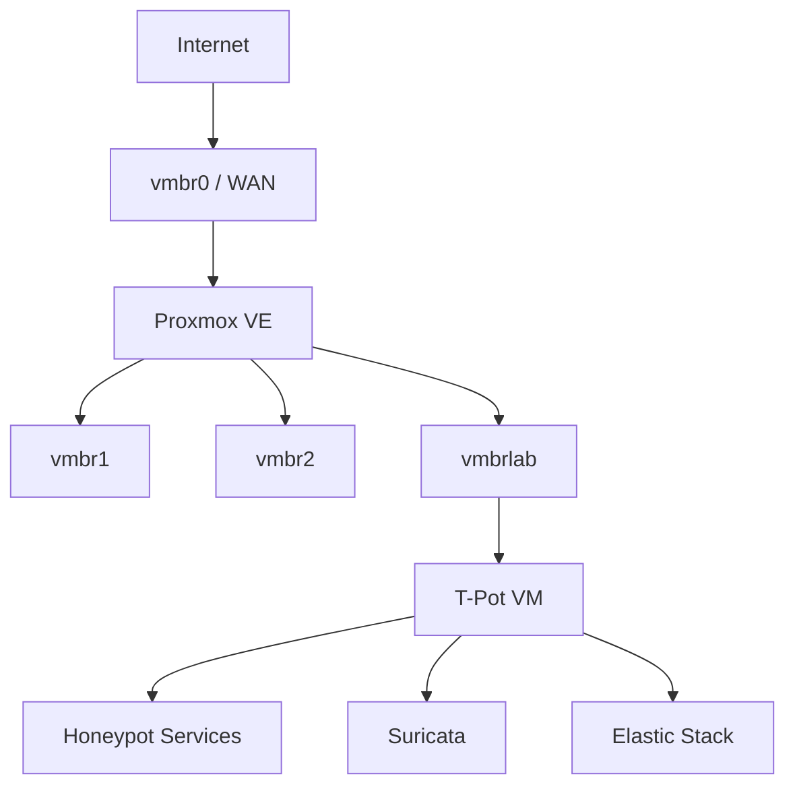

# Proxmox T-Pot Honeypot Lab

A self-hosted cybersecurity lab built with **Proxmox VE**, **Debian**, and **T-Pot** for exposing selected honeypot services, collecting Internet telemetry, and performing repeatable attack investigations.

The environment places T-Pot in a dedicated virtual lab network. The Proxmox host provides routing, NAT, ingress filtering, restricted egress, connection tracking, and isolation from trusted internal networks.

This repository focuses on the **honeypot platform, containment controls, telemetry, investigation workflow, and selected case studies**. The underlying Proxmox network platform is documented separately in [Proxmox-Network-Lab](https://github.com/KJabaX/Proxmox-Network-Lab).

> **Public portfolio snapshot:** Environment-specific private addresses, local usernames, and plaintext honeypot credentials have been replaced with placeholders or redacted. Raw evidence, packet captures, evidence bundles, and captured binaries are intentionally not included.

---

## Highlights

- T-Pot running in an isolated Proxmox VM
- Dedicated `vmbrlab` cybersecurity network
- Internet-facing honeypot services using DNAT
- Dedicated `TPOT-INGRESS` firewall chain
- Restricted outbound connectivity and trusted-network isolation
- Stateful filtering with Linux connection tracking
- Persistent firewall and NAT configuration
- Cowrie, Dionaea, SNARE/Tanner, Mailoney, SentryPeer, RDPHoneypot and other services
- Suricata network telemetry
- Elasticsearch and Kibana analysis
- Repeatable source-IP investigation workflow
- IOC extraction, OSINT, PCAP analysis, campaign correlation, and evidence-integrity steps
- Static-analysis workflow for captured or suspected artifacts
- Selected real-world case studies based on observed honeypot telemetry

---

## Architecture



The T-Pot VM is connected to the isolated lab bridge:

```text
Bridge:  vmbrlab
Network: <lab-subnet>
Address: <honeypot-address-cidr>
Gateway: <lab-gateway>
```

The lab can receive intentionally forwarded Internet traffic while remaining separated from trusted internal networks.

More detail: [Architecture](docs/architecture.md)

---

## Traffic Flow

### Public Honeypot Ingress

```text
Internet
   |
 vmbr0
   |
 DNAT
   |
 FORWARD
   |
 TPOT-INGRESS
   |
 vmbrlab
   |
 T-Pot
```

DNAT forwards selected public ports to the T-Pot VM. The dedicated `TPOT-INGRESS` chain determines which forwarded honeypot services are accepted, with non-allowlisted forwarded traffic dropped.

### Restricted Egress

```text
T-Pot
  |
vmbrlab
  |
Firewall
  |
Allowed DNS / HTTP / HTTPS
  |
MASQUERADE
  |
vmbr0
  |
Internet
```

The honeypot is not given unrestricted outbound connectivity. New connections from the lab toward trusted LAN and Wi-Fi networks are blocked.

See:

- [Network Configuration](docs/network-configuration.md)
- [Security Design](docs/security.md)

---

## T-Pot Environment

| Component | Value |
|---|---|
| Hypervisor | Proxmox VE |
| Guest OS | Debian 13.7 Trixie |
| Honeypot platform | T-Pot 24.04.1 |
| vCPU | 4 |
| RAM | 16 GiB |
| Disk | ~256 GiB |
| Swap | 8 GiB |
| Bridge | `vmbrlab` |
| T-Pot address | `<honeypot-address-cidr>` |
| Gateway | `<lab-gateway>` |

Installation details: [Installation and VM Setup](docs/installation.md)

---

## Honeypot and Monitoring Services

The environment includes multiple honeypots and supporting components, including:

- Cowrie
- Dionaea
- SNARE / Tanner
- Heralding
- Mailoney
- SentryPeer
- Redis honeypot
- RDPHoneypot
- Suricata
- Elasticsearch
- Logstash
- Kibana

Only selected honeypot ports are intentionally forwarded through the Proxmox host. T-Pot management services remain separate from public honeypot ingress.

---

## Security Design

The containment model is summarized as:

```text
Internet -> selected honeypot services     ALLOWED

T-Pot -> trusted LAN NEW                   BLOCKED
T-Pot -> Wi-Fi NEW                         BLOCKED

T-Pot -> DNS                               RESTRICTED
T-Pot -> HTTP / HTTPS                      ALLOWED
T-Pot -> other outbound traffic            LOG + DROP
```

`ESTABLISHED` and `RELATED` return traffic is handled using Linux connection tracking.

Captured files are treated as potentially malicious. The documented workflow favors hashing and static analysis rather than execution.

See [Security Design](docs/security.md).

---

## Attack Analysis Workflow

[`T-Pot-Attack-Analysis/`](T-Pot-Attack-Analysis/) contains the reusable investigation material.

The workflow starts with service triage instead of assuming that every source belongs to an SSH/Cowrie case. It then moves through the honeypot and network sources relevant to the observed destination ports.

Key guides include:

| Guide | Purpose |
|---|---|
| [00 - T-Pot Attack Triage](T-Pot-Attack-Analysis/00-T-Pot-Attack-Triage.md) | Identify targeted ports, protocols and relevant honeypots |
| [01 - Cowrie Attack Investigation](T-Pot-Attack-Analysis/01-Cowrie-Attack-Investigation.md) | SSH/Telnet sessions, authentication, commands and downloads |
| [02 - Suricata Network Investigation](T-Pot-Attack-Analysis/02-Suricata-Network-Investigation.md) | Network-wide correlation |
| [03 - Malware Static Analysis](T-Pot-Attack-Analysis/03-Malware-Static-Analysis.md) | Static analysis workflow for captured artifacts |
| [04 - IP OSINT](T-Pot-Attack-Analysis/04-IP-OSINT.md) | WHOIS, ASN, reverse DNS and infrastructure context |
| [05 - PCAP Network Analysis](T-Pot-Attack-Analysis/05-PCAP-Network-Analysis.md) | Packet-level analysis |
| [06 - Investigation Workflow](T-Pot-Attack-Analysis/06-T-Pot-Investigation-Workflow.md) | End-to-end workflow |
| [07 - RDPHoneypot Investigation](T-Pot-Attack-Analysis/07-RDPHoneypot-Investigation.md) | RDP/NLA/NTLM telemetry and Suricata correlation |
| [Manual Workflow](T-Pot-Attack-Analysis/manual-workflow/README.md) | Stage-by-stage manual equivalent of the automated report workflow |

---

## Selected Investigations

The [`investigations/`](investigations/) directory contains selected case studies built from real honeypot observations.

Current examples include:

- [EternalBlue-like SMBv1 attempt](investigations/smbv1-eternalblue-like-attempt/) — sanitized analysis of crafted transaction data and evidence limitations

- `103.174.102.29` — Cowrie SSH credential activity, Suricata correlation, timeline, IOC extraction and enrichment
- `62.210.205.239` — high-volume Dionaea MSSQL credential guessing, Suricata correlation and campaign-level analysis
- `45.148.10.5` — retained partial historical observation

Source IPs are included as observed network indicators. They do not establish the identity or ownership of a human actor. See [Investigation Cases](investigations/README.md).

---

## Evidence Handling

The public repository contains **documentation and summarized findings**, not raw collected evidence.

Excluded from the public snapshot include:

- raw JSON/JSONL honeypot exports
- packet captures
- evidence archives
- environment files and keys
- captured binaries or malware samples
- plaintext accepted honeypot credentials

The manual workflow documents evidence hashing and integrity checks so that private case bundles can still be handled reproducibly without publishing them.

---

## Validation

Useful validation commands include:

```bash
ip route
sudo docker ps

sudo iptables -L FORWARD -v -n --line-numbers
sudo iptables -L TPOT-INGRESS -v -n --line-numbers

sudo iptables -t nat -L PREROUTING -v -n --line-numbers
sudo iptables -t nat -L POSTROUTING -v -n --line-numbers
sudo iptables -t raw -L PREROUTING -v -n --line-numbers
```

Packet capture is also used during controlled validation to confirm that forwarded Internet traffic reaches the intended T-Pot service.

See [Troubleshooting](docs/troubleshooting.md).

---

## Documentation

| Document | Purpose |
|---|---|
| [Architecture](docs/architecture.md) | Overall design and traffic paths |
| [Installation](docs/installation.md) | Debian VM and T-Pot setup |
| [Network Configuration](docs/network-configuration.md) | Routing, NAT, DNAT, ingress and egress |
| [Security](docs/security.md) | Isolation and containment design |
| [Troubleshooting](docs/troubleshooting.md) | Problems encountered and fixes |
| [Implementation Notes](docs/implementation-notes.md) | Sanitized historical implementation log |

---

## Repository Structure

```text
Proxmox-TPot-Honeypot-Lab/
├── .gitignore
├── README.md
├── docs/
│   ├── architecture.md
│   ├── installation.md
│   ├── network-configuration.md
│   ├── security.md
│   ├── troubleshooting.md
│   └── implementation-notes.md
├── T-Pot-Attack-Analysis/
│   ├── 00-T-Pot-Attack-Triage.md
│   ├── 01-Cowrie-Attack-Investigation.md
│   ├── 02-Suricata-Network-Investigation.md
│   ├── 03-Malware-Static-Analysis.md
│   ├── 04-IP-OSINT.md
│   ├── 05-PCAP-Network-Analysis.md
│   ├── 06-T-Pot-Investigation-Workflow.md
│   ├── 07-RDPHoneypot-Investigation.md
│   ├── README.md
│   └── manual-workflow/
│       ├── README.md
│       └── 00-... through 13-...
└── investigations/
    ├── README.md
    ├── 103.174.102.29/
    ├── 62.210.205.239/
    └── 45.148.10.5.md
```

---

## Related Project

The Proxmox networking, bridges, internal routing, NAT, and general infrastructure design are documented in:

[**Proxmox-Network-Lab**](https://github.com/KJabaX/Proxmox-Network-Lab)

That repository covers the underlying virtualization and network platform, while this repository focuses on the T-Pot deployment, containment, telemetry, and investigations.

---

## Future Development

Possible next steps include:

- further selective honeypot service exposure
- additional structured investigations
- improved IOC extraction and enrichment
- additional campaign-correlation examples
- monitoring and alerting improvements
- continued validation of isolation and egress controls
- publishing sanitized helper tooling separately when appropriate
