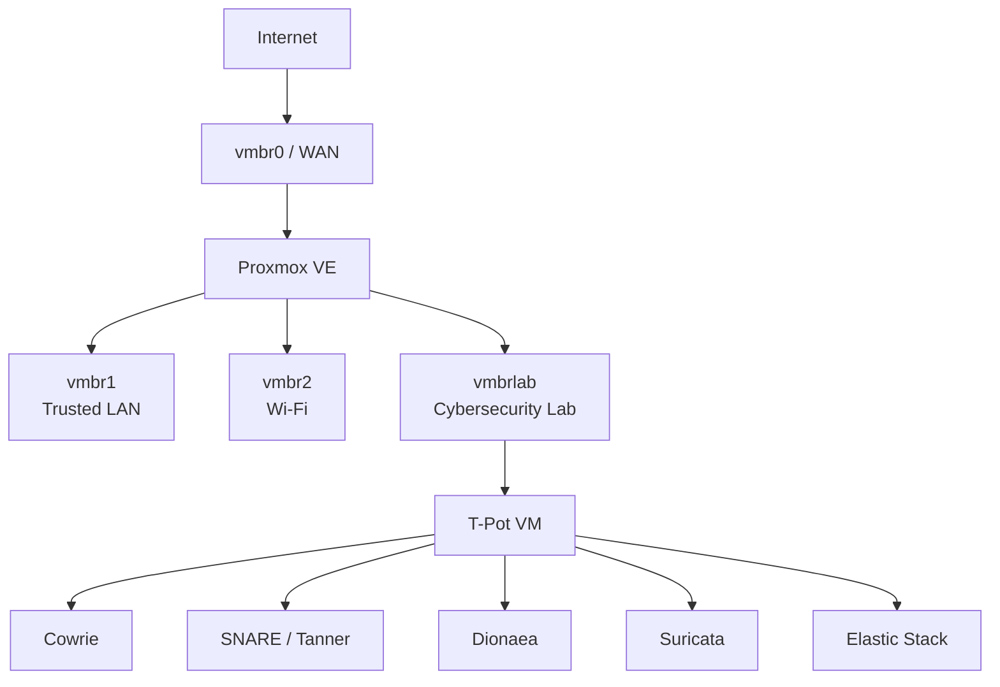

# Architecture

## Overview

This project runs T-Pot as an Internet-facing honeypot inside an isolated Proxmox VE lab network.

The design separates the honeypot from trusted internal systems while still allowing selected inbound honeypot traffic and tightly controlled outbound connectivity.



## Network Segments

| Segment | Network | Purpose |
|---|---|---|
| `vmbr0` | Upstream / DHCP | Internet-facing Proxmox interface |
| `vmbr1` | `<trusted-lan-subnet>` | Trusted management LAN |
| `vmbr2` | `<wifi-subnet>` | Separate Wi-Fi network |
| `vmbrlab` | `<lab-subnet>` | Isolated cybersecurity lab |

The T-Pot VM uses:

```text
IP:      <honeypot-address-cidr>
Gateway: <lab-gateway>
Bridge:  vmbrlab
```

`vmbrlab` is a virtual-only bridge and has no dedicated physical bridge port.

## Traffic Model

### Inbound

Selected public honeypot services follow this path:

```text
Internet
   |
 vmbr0
   |
 DNAT
   |
 FORWARD
   |
 TPOT-INGRESS
   |
 vmbrlab
   |
 T-Pot
```

DNAT decides where the connection is sent. The `TPOT-INGRESS` chain decides whether the forwarded connection is permitted.

### Outbound

T-Pot outbound traffic follows:

```text
T-Pot
  |
vmbrlab
  |
egress filtering
  |
MASQUERADE
  |
vmbr0
  |
Internet
```

Only explicitly permitted outbound traffic is allowed.

### Trusted-Network Isolation

New connections originating from the honeypot network toward trusted internal networks are blocked:

```text
vmbrlab -> vmbr1  DROP
vmbrlab -> vmbr2  DROP
```

Return traffic for already permitted connections is handled through connection tracking.

## Management Plane

T-Pot management services are intentionally separate from honeypot service ports.

| Service | Port |
|---|---:|
| T-Pot SSH management | `64295/tcp` |
| T-Pot Web UI | `64297/tcp` |
| Kibana | `127.0.0.1:64296` |
| Elasticsearch | `127.0.0.1:64298` |

Common honeypot ports such as TCP/22 are reserved for honeypot services rather than administrative SSH.

## Design Goals

The architecture is built around four goals:

- keep the honeypot separated from trusted systems,
- expose only intentionally selected honeypot services,
- restrict outbound traffic from the lab,
- preserve enough telemetry for attack investigation and learning.

Detailed firewall and network behavior is documented in [Network Configuration](network-configuration.md) and [Security](security.md).
